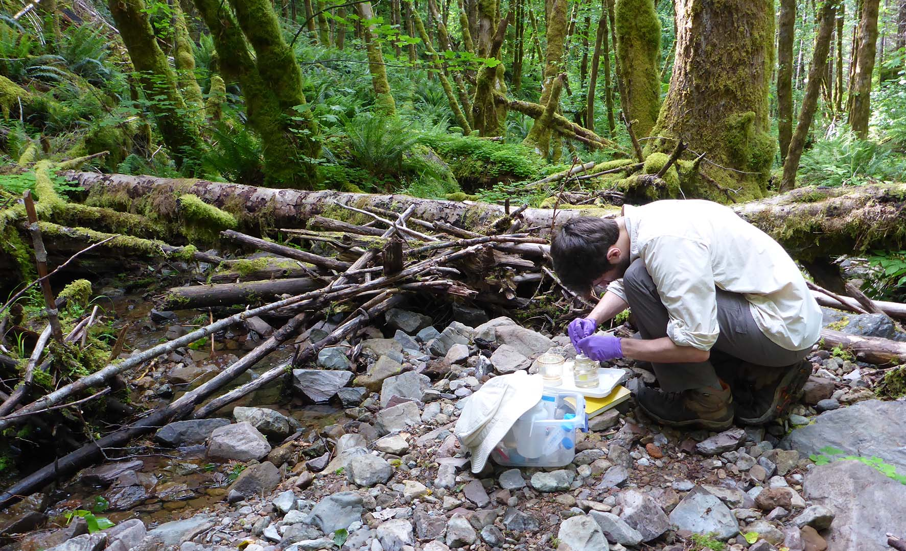

I'm a PhD candidate studying microbial ecology in the [Lennon Lab](http://www.indiana.edu/~microbes/) at [Indiana University](http://www.bio.indiana.edu/). 
I am especially interested in how dormancy and dispersal influence ecological communities.

Check out my [research](research.html) page to learn more about my ongoing projects.

Additional interests of mine include playing guitar and listening to music (check out my [last.fm](https://www.last.fm/user/nawis1017)), reading (check out my [goodreads](https://www.goodreads.com/nawis)), hiking and nature photography (check out a small [gallery](images/photo_gallery/index.html)). 

