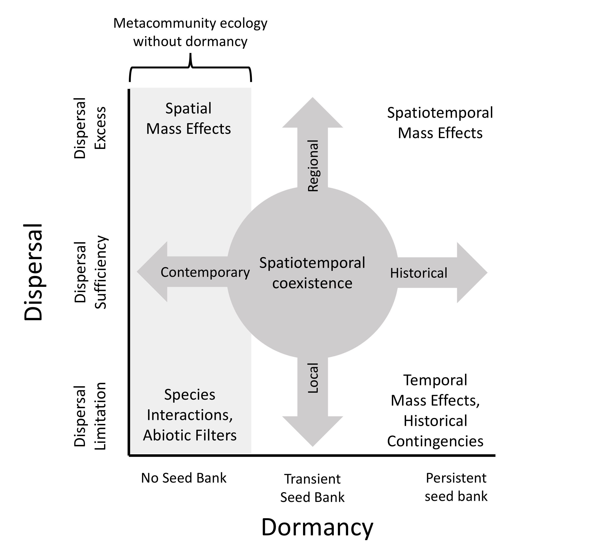

<style>
.column-left{
  float: left;
  width: 50%;
  text-align: left;
}

.column-right{
  float: right;
  width: 50%;
  text-align: left;
}
</style>


<div class="column-left">
```{r out.width='80%',fig.align='center',echo=FALSE}

```
</div>

<div class="column-right">
Metacommunity ecology has improved our understanding of how dispersal affects community structure and dynamics across spatial scales, but it has yet to adequately account for dormancy, a reversible state of reduced metabolic activity. Dormancy can influence metacommunities, most notably, by buffering against harsh environmental conditions and by modifying dispersal rates. Seed banks of long-lived dormant propagules can introduce historical controls on community structure that are decoupled from contemporary dispersal rates. With coauthors [Mathew Leibold](http://www.leiboldlab.com/) and [Jay Lennon](https://www.indiana.edu/~microbes/), I developed a framework for predicting how dormancy might alter the local, regional, and historical factors that influence community assembly, structure, and dynamics in metacommunities. Our preprint presents a brief review of case studies from a range of ecosystems, results from simple simulation models, and an empirical data analysis from a metacommunity system.

#### Relevant manuscripts:  
- Wisnoski, Nathan I., Mathew A. Leibold, and Jay T. Lennon. (in review). Dormancy in metacommunities. Check out the [preprint](https://osf.io/ujmzc/).
</div>