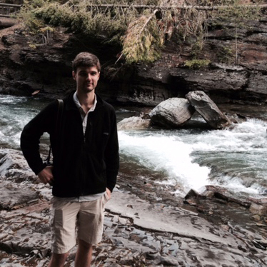

<style>
.column-left{
  float: left;
  width: 50%;
  text-align: left;
}

.column-right{
  float: right;
  width: 50%;
  text-align: left;
}
</style>

<div class="column-left">

```{r out.width='80%',fig.align='center',echo=FALSE}

```
</div>

<div class="column-right">
Microbial communities are some of the most taxonomically, phylogenetically, and functionally diverse biological systems on the planet. Furthermore, this high microbial diversity often persists even in ecosystems exhibiting high spatial and temporal variability. One explanation for their persistence is that microorganisms have evolved life history strategies to combat environmental variability. Two common strategies for coping with spatial and temporal variability are dispersal and dormancy, which may facilitate species coexistence and contribute to the maintenance of biodiversity across spatial scales.

My research uses fieldwork and simulation modeling to understand the relative importance of these ecological processes for maintaining biodiversity in dynamic ecosystems.

## Contact Info
To get in touch with [me](about.html), check out my [CV](Wisnoski_CV.pdf), send me an [email](mailto:wisnoski@indiana.edu), find me on [Google Scholar](https://scholar.google.com/citations?user=vAOr-MQAAAAJ&hl=en), or follow me on [twitter](https://www.twitter.com/nwisnoski).
</div>

