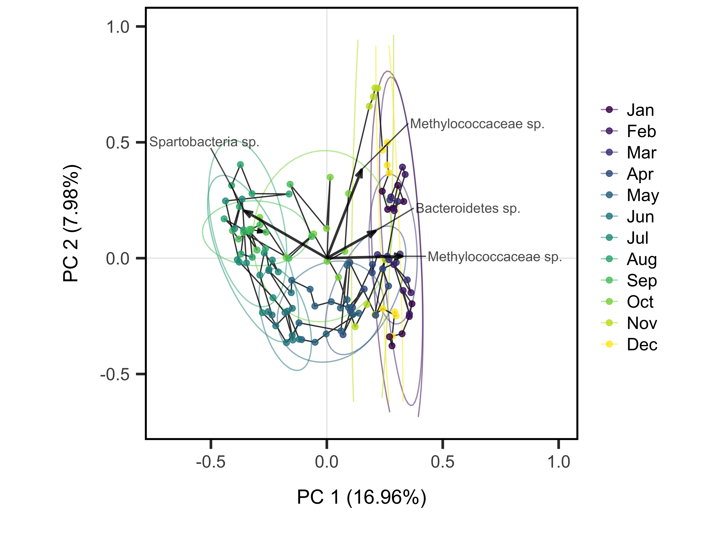
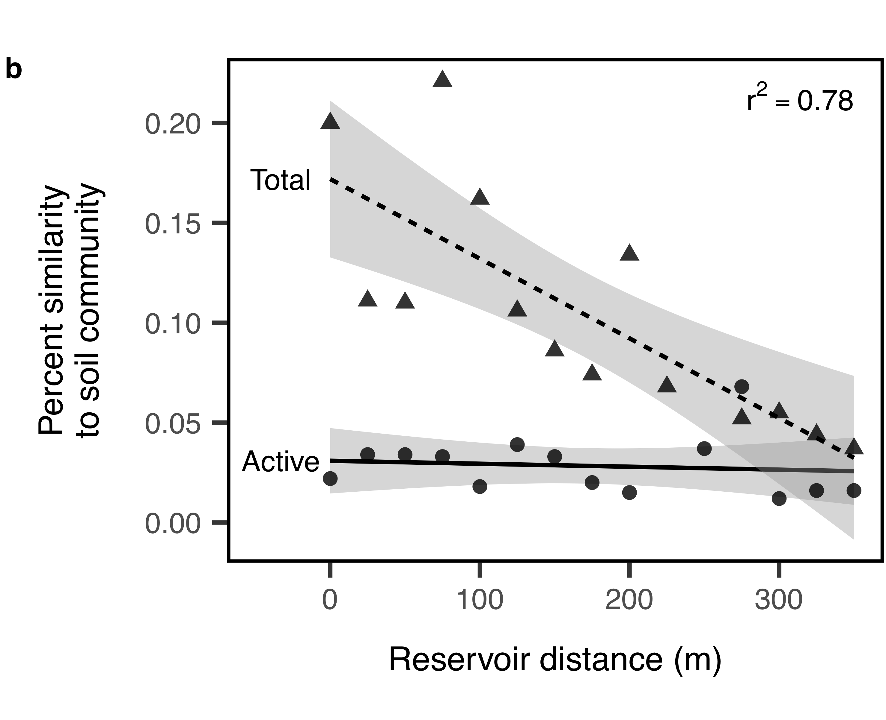

<style>
.column-left{
  float: left;
  width: 50%;
  text-align: left;
}

.column-right{
  float: right;
  width: 50%;
  text-align: left;
}
</style>


<div class="column-right">
Bacterial communities in lakes and reservoirs are structured by a combination of local and regional factors. In the lake, species interactions and environmental heterogeneity allow different species to be favored in different microhabitats or at different times of the year if species show differential responses to the environment, potentially allowing species to coexist. Stabilizing coexistence may be likely in microbical communities due to the ability of many taxa to enter dormancy, which can buffer against suboptimal changes in the environment and modify the relative strength of inter and intraspecific competition. We found support for these hypotheses from a high-resolution time series of active and total (active + dormant) bacterial diversity along with a suite of environmental variables.

Because lakes are open systems, however, they also receive inputs of resources, energy, and organisms from surrounding terrestrial landscapes. To determine whether the effects of terrestrial inputs are greater for metabolically active than total bacterial communities, we sampled along a terrestrial--aquatic transect and analyzed patterns of bacterial diversity. We found evidence that soils potentially support strong source-sink dynamics across the terrestrial-aquatic boundary, but that these effects are largely restricted to the total, not the active, lake bacterial community community. Moreover, we found that few of these immigrating taxa become abundant members of the active community. 

#### Relevant manuscripts:

- Wisnoski, N.I. and J.T. Lennon. The contribution of “seed banks” to bacterial community dynamics. In prep.

- **Wisnoski, N.I.**, M.E. Muscarella, M.L. Larsen, A.L. Peralta, and J.T. Lennon. In press. [Metabolic insight into bacterial community assembly across ecosystem boundaries](https://doi.org/10.1002/ecy.2968). Ecology.


</div>

<div class="column-left">
```{r out.width='80%',fig.align='center',echo=FALSE}


```

</div>