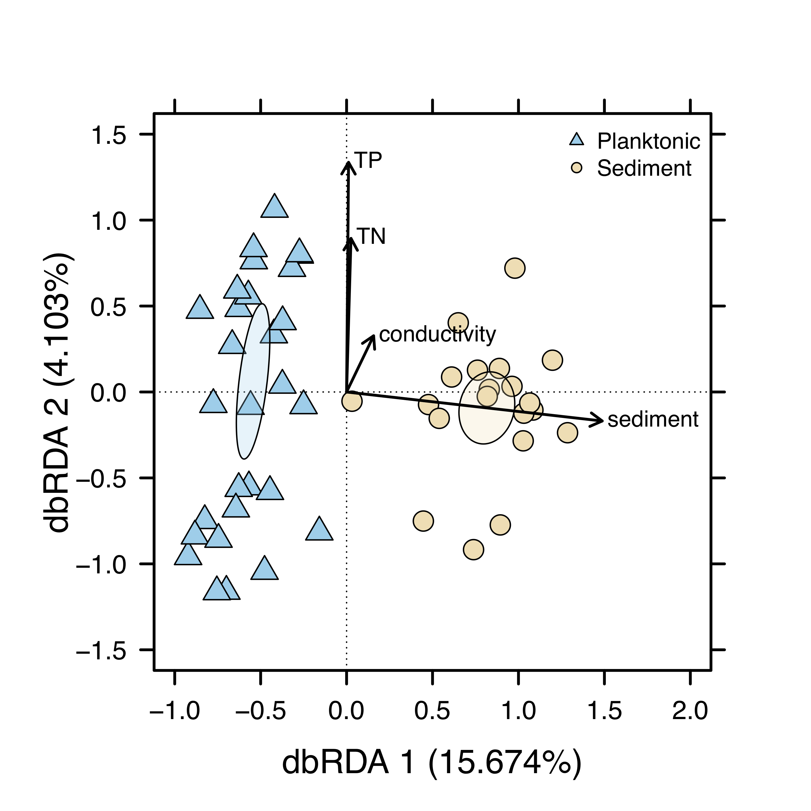

<style>
.column-left{
  float: left;
  width: 50%;
  text-align: left;
}

.column-right{
  float: right;
  width: 50%;
  text-align: left;
}
</style>


<div class="column-left">
Ecological communities do not occur in isolation, but rather, they are connected by the dispersal of potentially interacting species to form a metacommunity. The study of metacommunities in dendritic networks, such as streams, has demonstrated the usefulness of this perspective, generating a range of hypotheses about how local and regional-scale processes vary in importance across the stream network. My research investigates the relative importance of local conditions (e.g., hydrological, chemical, or biotic variables) and dispersal/connectivity for benthic and planktonic bacterial diversity across a 5th-order stream network at the [H. J. Andrews Experimental Forest](http://andrewsforest.oregonstate.edu/), a Long-Term Ecological Research ([LTER](https://lternet.edu/)) site in Oregon, USA. This work is conducted in collaboration with [Adam Ward](http://www.indiana.edu/~hydro/). 


#### Relevant manuscripts (in prep): 
- Wisnoski, Nathan I. and Jay T. Lennon. Habitat-specific community assembly processes in a dendritic metacommunity.
</div>

<div class="column-right">
```{r out.width='80%',fig.align='center',echo=FALSE}

```
</div>