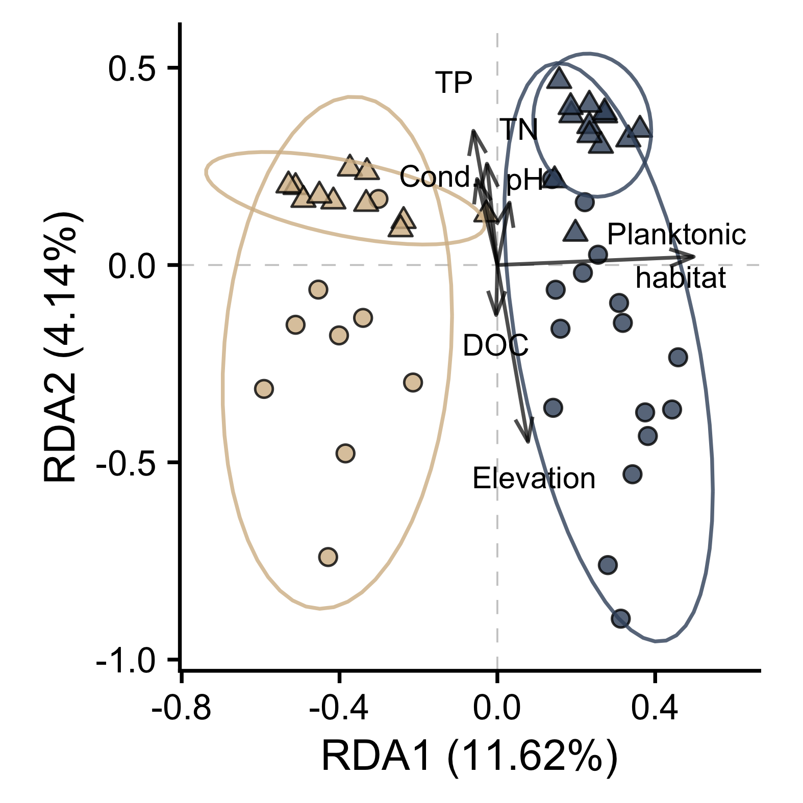

<style>
.column-left{
  float: left;
  width: 50%;
  text-align: left;
}

.column-right{
  float: right;
  width: 50%;
  text-align: left;
}
</style>


<div class="column-left">
The study of metacommunities in dendritic networks, such as streams, has generated a range of hypotheses about how local and regional-scale processes vary in importance across the stream network. However, dispersal/connectivity also varies along the vertical dimension distinguishing benthic from planktonic habitats. I tested whether these vertical differences influenced the relative importance of community assembly mechanisms across spatial scales and network position in a 5th-order stream network at the [H. J. Andrews Experimental Forest](http://andrewsforest.oregonstate.edu/), a Long-Term Ecological Research ([LTER](https://lternet.edu/)) site in Oregon, USA. 

#### Relevant manuscripts (in prep): 
- Wisnoski, Nathan I. and Jay T. Lennon. Microbial community assembly in a dendritic metacommunity is habitat- and scale-dependent.
</div>

<div class="column-right">
```{r out.width='80%',fig.align='center',echo=FALSE}

```
</div>